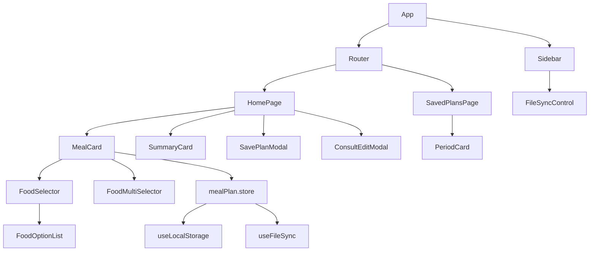

# DietPlan

## Sobre o projeto

DietPlan e um app Vue para montar, ajustar e salvar planos alimentares com substituicoes por refeicao. O estado fica no navegador via `localStorage`, com historico de cardapios por periodo e dados da consulta nutricional. Opcionalmente, o plano tambem pode ser espelhado em tempo real para um arquivo `.json` local via File System Access API (ver `useFileSync`).

## Stack

- Vue 3.4 com Composition API e `<script setup lang="ts">`
- Pinia para estado global
- Vue Router para paginas
- TypeScript, Vite e Tailwind CSS
- Material Symbols Outlined para icones

## Comandos

- `npm run dev`: servidor Vite local
- `npm run build`: typecheck com `tsc` e build Vite
- `npm run build:docs`: build para GitHub Pages com `VITE_BASE_PATH=/dietPlan/`
- `npm run preview`: preview do build

## Estrutura

```text
src/
  App.vue
  main.ts
  components/
    consult/ ConsultEditModal.vue
    food/ FoodOptionList.vue, FoodSelector.vue, FoodMultiSelector.vue
    layout/ Sidebar.vue
    meal/ MealCard.vue
    period/ PeriodCard.vue, SavePlanModal.vue
    shared/ SummaryCard.vue, FileSyncControl.vue
  composables/ useLocalStorage.ts, useFileSync.ts
  data/ dados estaticos de alimentos
  pages/ HomePage.vue, SavedPlansPage.vue
  router/ index.ts
  services/ mealPlanService.ts
  stores/ mealPlan.store.ts
  types/ index.ts
```

## Convencoes Vue

- Use sempre Composition API com `<script setup lang="ts">`.
- Componentes ficam organizados por dominio: `layout/`, `food/`, `meal/`, `period/`, `consult/`, `shared/`.
- Estado compartilhado passa por `useMealPlanStore`; modais emitem eventos e paginas chamam actions.
- UI em portugues; datas exibidas como `DD/MM/YYYY` e armazenadas como ISO `YYYY-MM-DD`.
- Estilos usam Tailwind e tokens de [tailwind.config.js](tailwind.config.js): `surface`, `card`, `primary`, `secondary`.
- Icones usam Material Symbols via texto do icone.
- Modais usam `<teleport to="body">`.
- Evite slots neste projeto; prefira props, emits ou componentes irmaos.

## Fluxo De Dados



## Skills Disponiveis

| Skill | Usar quando... | Arquivo |
| --- | --- | --- |
| vue-conventions | Ajustar padroes Vue, Tailwind, tipos ou organizacao geral | [.agents/skills/vue-conventions/SKILL.md](.agents/skills/vue-conventions/SKILL.md) |
| layout-sidebar | Editar navegacao lateral, rotas visiveis ou badge de salvos | [.agents/skills/layout-sidebar/SKILL.md](.agents/skills/layout-sidebar/SKILL.md) |
| food-option-list | Alterar lista base de opcoes, radio ou select | [.agents/skills/food-option-list/SKILL.md](.agents/skills/food-option-list/SKILL.md) |
| food-selector | Editar substituicao unica de alimento | [.agents/skills/food-selector/SKILL.md](.agents/skills/food-selector/SKILL.md) |
| food-multi-selector | Editar selecao multipla, chips ou dropdown | [.agents/skills/food-multi-selector/SKILL.md](.agents/skills/food-multi-selector/SKILL.md) |
| meal-card | Editar card de refeicao, categorias ou substituicoes | [.agents/skills/meal-card/SKILL.md](.agents/skills/meal-card/SKILL.md) |
| period-card | Editar cardapio salvo, status, accordion ou impressao | [.agents/skills/period-card/SKILL.md](.agents/skills/period-card/SKILL.md) |
| save-plan-modal | Editar formulario de salvar cardapio | [.agents/skills/save-plan-modal/SKILL.md](.agents/skills/save-plan-modal/SKILL.md) |
| consult-edit-modal | Editar formulario de consulta nutricional | [.agents/skills/consult-edit-modal/SKILL.md](.agents/skills/consult-edit-modal/SKILL.md) |
| summary-card | Editar resumo diario e contadores | [.agents/skills/summary-card/SKILL.md](.agents/skills/summary-card/SKILL.md) |
| page-home | Orquestrar plano atual, modais, reset e salvamento | [.agents/skills/page-home/SKILL.md](.agents/skills/page-home/SKILL.md) |
| page-saved-plans | Editar pagina de cardapios salvos e grupos por periodo | [.agents/skills/page-saved-plans/SKILL.md](.agents/skills/page-saved-plans/SKILL.md) |
| meal-plan-store | Alterar estado, actions, migracao ou chaves localStorage | [.agents/skills/meal-plan-store/SKILL.md](.agents/skills/meal-plan-store/SKILL.md) |
| use-local-storage | Alterar persistencia generica em localStorage | [.agents/skills/use-local-storage/SKILL.md](.agents/skills/use-local-storage/SKILL.md) |
| use-file-sync | Alterar sincronizacao com arquivo .json local, permissao ou FileSyncControl | [.agents/skills/use-file-sync/SKILL.md](.agents/skills/use-file-sync/SKILL.md) |
| vue-router | Alterar rotas, base URL ou navegacao | [.agents/skills/vue-router/SKILL.md](.agents/skills/vue-router/SKILL.md) |

## Restricoes

- Nao altere `VITE_BASE_PATH`/`BASE_URL` sem revisar deploy em GitHub Pages.
- O schema persistido do store usa migracao; mantenha `CURRENT_VERSION = 4` ou incremente com migracao explicita.
- `@vueuse/core` esta instalado, mas a persistencia atual usa composable proprio.
- Nao documente segredos nem dados sensiveis.
